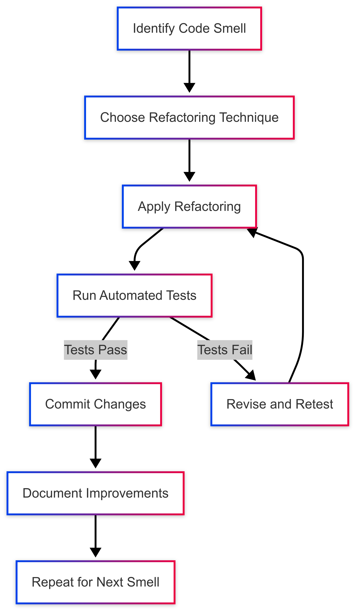

[](https://classroom.github.com/a/_Y4t8UXw)
# dgl104-programming-article-repo

## Introduction
 Refactoring is the process of restructuring code, while not changing its original functionality. The goal of refactoring is to improve internal code by making many small changes without altering the code's external behavior.

Computer programmers and software developers refactor code to improve the design, structure and implementation of software. Refactoring improves code readability and reduces complexities. Refactoring can also help software developers find bugs or vulnerabilities hidden in their software.

The refactoring process features many small changes to a program's source code. One approach to refactoring, for example, is to improve the structure of source code at one point and then extend the same changes systematically to all applicable references throughout the program. The thought process is that all the small, behavior-preserving changes to a body of code have a cumulative effect. These changes preserve the software's original behavior and do not modify its behavior.

---

## The Refactoring Process

Refactoring follows the systematic approach to ensure code stability while improving its structure.

1. Identify areas for improvement - code smells signal the need for refactoring.
2. Apply refactoring techniques - Techniques like as Decompose Conditionals, Replace Temp with Constant, and Extract Method aid in code simplification.
3. Test the code - Making sure that after restructuring, no functionality is broken
   
## Common code Smells That Require Refactoring
*  **Long Methods** - Too many responsibilities in one function.
*  **Duplicate code** - Repeating same logic multiple times.
*  **Large class** - single class which handel multiple operations.
*  **Complicated conditionals** - Long conditional statements
*  **Too many parameters** - functions with many arguments which is hard to track.

Below is the flowchart that demonstrate refactoring process.



---
## When Code should refactor?
Refactoring can be performed after a product has been deployed, before adding updates and new features to existing code, or as a part of day-to-day programming.

When the process is performed after deployment, it is normally done before developers move on to the next project. An organization may be able to refactor more code at this point in the software delivery lifecycle, where the developers have increased availability and more time to work on the source code changes needed.

A better time to perform refactoring, though, is before adding updates or new features to existing code. When performed at this point, refactoring makes it easier for developers to build onto the existing code because they are going back and simplifying the code, making it easier to read and understand.

When an organization has a strong grasp on the refactoring process, it can make it a regular process. Whenever a developer needs to add something to a code base, they can look at the existing code to see if it is structured in a way that would make the process of adding new code straightforward. If it is not, then the developer can refactor the existing code. Once the new code is added, the developer can refactor the same code again to make it clearer.
## What is benefits of refactoring?
Refactoring can provide the following benefits:
* Makes the code easier to understand and read because the goal is to simplify code and reduce complexities.
* Improves maintainability and makes it easier to spot bugs or make further changes.
* Encourages a more in-depth understanding of code. Developers have to think further about how their code will mix with code already in the code base.
* Focus remains only on functionality. Not changing the code's original functionality ensures the original project does not lose scope.
  
## What are challenges of refactoring?
Challenges do come with the process, however. Some of these include:

* The process will take extra time if a development team is in a rush and refactoring is not planned for.
* Without clear objectives, refactoring can lead to delays and extra work.
* Refactoring cannot address software flaws by itself, as it is made to clean code and make it less complex.

## Understand the real impact of code strategic code refactoring.
### Making Technical Improvements Work For Business Goals.
Teams often find it tricky to balance fixing technical issues while meeting immediate business demands. The key is focusing on improvements that clearly support business objectives. This could mean speeding up essential features, reducing customer-facing bugs, or making the code more flexible for future growth. Taking this targeted approach helps teams show the real value of refactoring to decision makers.

Code refactoring delivers measurable benefits - it can cut update times by up to **50%** and significantly reduce bug-fixing costs. Clean, well-organized code helps systems run faster and lets developers hit their deadlines more reliably. Want to learn more? Check out this helpful guide: https://imaginovation.net/blog/code-refactoring-complete-guide/

### Getting Leadership Support For Refactoring Projects
To get backing for refactoring work, teams need to show clear business benefits using real numbers and concrete examples. Show how refactoring can speed up development, cut costs, improve reliability, and help launch features faster. Using charts and data to highlight improvements in key metrics helps business leaders understand the value. Be upfront that while some benefits take time to show up, the long-term gains make refactoring worth the investment. Regular updates keep stakeholders informed and supportive.

### Real Examples: Quick Wins and Long-Term Value
While major benefits like reduced technical debt build up over time, refactoring also offers immediate advantages. For instance, moving complex code into well-named, separate functions instantly makes the code easier to understand and work with. Removing duplicate sections right away reduces errors and simplifies future changes. These quick improvements demonstrate refactoring’s value and build support for bigger projects. When teams consistently improve their code this way, it creates a culture focused on quality work.

**Mastering Essential Refactoring Patterns That Drive Results**:

Every great codebase needs thoughtful restructuring to stay maintainable. Let’s explore proven refactoring patterns that top development teams use to strengthen their code. We’ll look at **Extract Method**, **Move Method**, and **Replace Conditional** with **Polymorphism** - three key patterns that go beyond surface-level cleanup to meaningfully improve how code works. Through practical examples, we’ll see how teams apply these patterns effectively.


**Extract Method: Simplifying Complex Logic**


The **Extract Method** pattern helps break down large, complex methods into smaller, focused pieces. When you spot a method getting too long or doing too many things, pulling out chunks of related code into separate methods makes everything clearer and more reusable. Think of a shopping cart total calculation that handles prices, discounts, and taxes all in one place.

Here’s a typical example before refactoring:

public double calculateTotal(List items) { double total = 0; for (Item item : items) { total += item.getPrice(); } // Complex discount calculation logic here… return total; }

And after applying Extract Method:

public double calculateTotal(List items) { double total = 0; for (Item item : items) { total += item.getPrice(); } total -= calculateDiscount(items, total); return total; }

private double calculateDiscount(List items, double total) { // Complex discount calculation logic here… return discountAmount; }

This change makes the code easier to test and debug since each piece has a clear, single purpose.

**Move Method: Improving Code Cohesion**

The **Move Method** pattern helps put code where it belongs. When a method seems out of place in its current class, moving it to a more logical home can make the whole system clearer. For example, if order processing code lives in a Customer class but really belongs in the Order class, moving it there helps everyone understand the code’s organization better.

**Replace Conditional with Polymorphism: Achieving Flexibility and Extensibility**

Complex `if` statements can make code hard to follow and change. The **Replace Conditional with Polymorphism** pattern offers a cleaner solution by using object-oriented principles. Instead of long chains of conditions, you create specific classes for different behaviors. This makes adding new features much simpler - just create a new class rather than modifying existing code.

For example, rather than checking user types with `if` statements to control access, you can create separate `AdminUser` and `RegularUser` classes that each handle their own access rules. This makes the code easier to understand and expand.

Smart data organization plays a big role in effective refactoring. Simple changes like converting a complex leap year calculation into a single clear expression can reduce errors and make code 40% more maintainable. Want to learn more? Check out detailed examples of code refactoring patterns https://www.theserverside.com/tip/Code-refactoring-patterns-with-examples . 

By applying these essential patterns consistently, you’ll build code that’s easier to maintain, update, and scale. These aren’t just theoretical concepts - they’re practical tools that help teams work more efficiently and deliver better results.


## Six Essential Refactoring Techniques.

### 1. Extract Method: Breaking down Monoliths.
**Problem**: Large functions handling multiple tasks make debugging difficult.
**Solution**: Extract login into small and simple parts.
### Example -
**Before**:


```javascript
function processOrder(items) {
  let total = 0;
  for (const item of items) {
    total += item.price * item.quantity;
  }
  const discount = total > 500 ? total * 0.2 : 0;
  const tax = total * 0.08;
  return total - discount + tax;
}
```
**After**:

```javascript
function calculateSubtotal(items) {
  return items.reduce((sum, item) => sum + (item.price * item.quantity), 0);
}

function calculateDiscount(subtotal) {
  return subtotal > 500 ? subtotal * 0.2 : 0;
}

function processOrder(items) {
  const subtotal = calculateSubtotal(items);
  const discount = calculateDiscount(subtotal);
  const tax = subtotal * 0.08;
  return subtotal - discount + tax;
}
```

#### **Benefits**: Smaller functions improve readability and reusability (Fowler, 1999; Martin, 2008).
---

### 2. Replace Temporary numbers/Literals with  constants
**Problem**: Unexplained Literals (literals are shorthand notation for values) reduce clarity.
**Solution**: Use constants to improve code maintenance.
### Example - 
**Before**:


```javascript
function calculateArea(radius) {
  return 3.14159 * radius ** 2;
}
```
**After**:

```javascript
const PI = 3.14159;
function calculateArea(radius) {
  return PI * radius ** 2;
}
```
#### **Benefits**: Constants improve clarity and reduce errors when updates are required.
---
### 3 Eliminate Duplicate code 
**Problem**: Logic that has been copied and pasted causes maintenance problems.
**Solution**: Extract repeated logic into reusable functions.
### Example - 

**Before**:


```javascript
function greetUser(user) {
  console.log(`Hello, ${user.name}!`);
}

function farewellUser(user) {
  console.log(`Goodbye, ${user.name}!`);
}
```
**After**:

```javascript
function formatMessage(user, message) {
  return `${message}, ${user.name}!`;
}

function greetUser(user) {
  console.log(formatMessage(user, "Hello"));
}

function farewellUser(user) {
  console.log(formatMessage(user, "Goodbye"));
}
```
#### **Benefits**: Prevents redundancy and simplifies maintenance.
### 4 Reduce the Complexity of Conditionals by Strategy/Polymorphism
**Problem**: When we have complex conditions like if-else/switch chains.
**Solution**: Use strategy pattern.
### Example - 

**Before**:


```javascript
function getAnimalSound(animalType) {
  switch (animalType) {
    case 'Dog': return 'Woof!';
    case 'Cat': return 'Meow!';
    default: throw new Error('Unknown animal');
  }
}
```
**After**:

```javascript
class Animal {
  makeSound() {
    throw new Error('Method not implemented');
  }
}

class Dog extends Animal {
  makeSound() {
    return 'Woof!';
  }
}

class Cat extends Animal {
  makeSound() {
    return 'Meow!';
  }
}
```
### 5 Decompose conditional logic
**Problem**: Nested conditions
### Example - 

**Before**:


```javascript
if (user.isAuthenticated && user.permissions.includes('edit') && !post.isLocked) {
  allowEdit();
}
```
**After**:

```javascript
function canEditPost(user, post) {
  return user.isAuthenticated 
    && user.permissions.includes('edit') 
    && !post.isLocked;
}

if (canEditPost(user, post)) {
  allowEdit();
}
```
### 6 Introduce Parameter object/ Data class
**Problem**: Too many parameters clutter functions signature.
**Solution**:Use a single object to hold multiple parameters.
### Example - 

**Before**:


```javascript
function createUser(name, email, age, address, phone) {
  // ...
}
```
**After**:

```javascript
function createUser({ name, email, age, address, phone }) {
  // ...
}

// Usage:
createUser({
  name: "Alice",
  email: "alice@example.com",
  // ...
});
```
---

## Code Refactoring best practices
Best practices to follow for refactoring include:

- **Plan for refactoring.** It may be difficult to make time for the time-consuming practice otherwise.
- **Refactor first.** Developers should do this before adding updates or new features to existing code to reduce technical debt.
- **Refactor in small steps.** This gives developers feedback early in the process so they can find possible bugs, as well as include business requests.
- **Set clear objectives.** Developers should determine the project scope and goals early in the code refactoring process. This helps to avoid delays and extra work, as refactoring is meant to be a form of housekeeping, not an opportunity to changes functions or features.
- **Test often.** This helps to ensure refactored changes do not introduce new bugs.
- **Automate wherever possible.** Automation tools make refactoring easier and faster, thus, improving efficiency.
- **Fix software defects separately.** Refactoring is not meant to address software flaws. Troubleshooting and debugging should be done separately.
- **Understand the code.** Review the code to understand its processes, methods, objects, variables and other elements.
- **Refactor, patch and update regularly.** Refactoring generates the most return on investment when it can address a significant issue without taking too much time and effort.
- **Focus on code deduplication.** Duplication adds complexities to code, expanding the software's footprint and wasting system resources.

## Conclusion  
JavaScript code refactoring guarantees maintainability and scalability. Using strategies like *Extract Function* and *Parameter Object* (Fowler, 1999) can help you design more extensible and debug-friendly code. Tools like SonarQube (SonarQube, n.d.) automate code smell detection.  
## References  
* Fowler, M. (1999). Refactoring: Improving the Design of Existing Code. Addison-Wesley.

* Martin, R. C. (2008). Clean Code: A Handbook of Agile Software Craftsmanship. Prentice Hall.

* SonarQube. (n.d.). Static Code Analysis Tool. Retrieved from https://github.com/SonarSource/sonarqube

* ESLint. (n.d.). Find and Fix Problems in Your JavaScript Code. Retrieved from https://eslint.org/

* Prettier. (n.d.). Opinionated Code Formatter. Retrieved from https://prettier.io/

* TechTarget. (n.d.). Refactoring Definition. Retrieved from https://www.techtarget.com/searchapparchitecture/definition/refactoring
* DocuWriter AI. (n.d.). Code Refactoring Examples. Retrieved from https://www.docuwriter.ai/posts/code-refactoring-examples